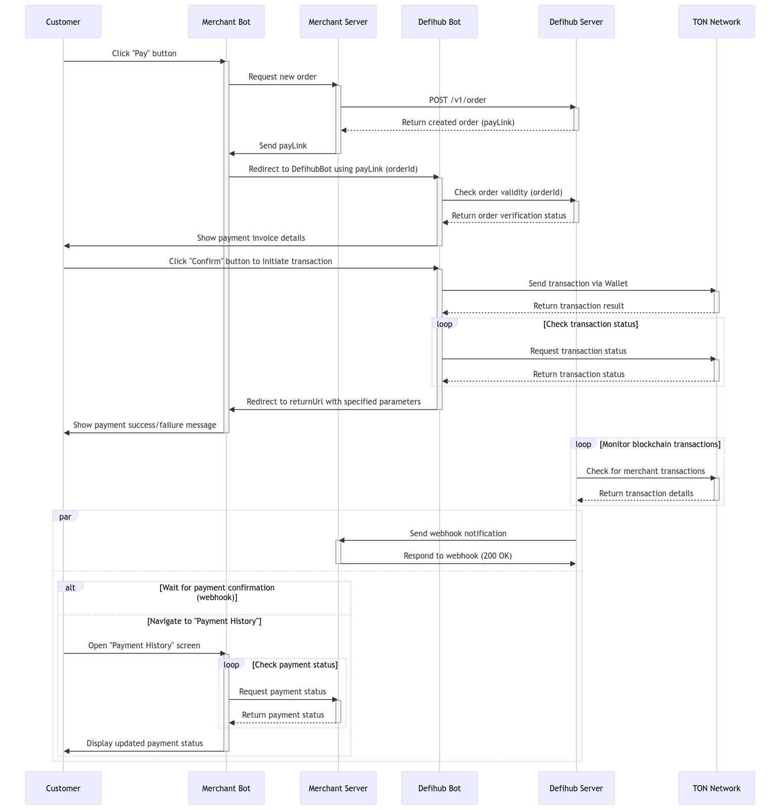

# Merchant Backend Demo

A simple backend demo of how to integrate with Defihub Payment.

## Overview



## Getting Started
### Prerequisites

Before you begin, ensure you have the following:

- Node.js (v14 or later)
- npm (v6 or later)
- An API key (Contact us to get your API key if you don't already have one)

### Installation
1. Clone the repository:
```bash
git clone https://github.com/DefiHub-Network/mc-backend-demo.git
cd mc-backend-demo
```
2. Install dependencies:
```bash
npm install
```

3. Configure environment variables:
- Create a .env file in the project root.
- Add the following variables:
```bash
DEFIHUB_SERVER_URL=https://payment-api.defihub.network
MERCHANT_API_KEY=<your-api-key>
MERCHANT_BOT_URL=<your-merchant-bot-url>
```

### Running the demo

```bash
npm run dev
```

## Project Structure

- `src/`: Contains the source files for the application.
  - `db.ts`: Simulates an in-memory database for demo purposes.
  - `index.ts`: The main server file that sets up the Express application - and routes.
  - `order.ts`: Handles order management logic, including creating and retrieving orders.
  - `webhook.ts`: Processes webhook verification and handles webhook events.

## Integration

For a complete integration example, refer to the [Merchant Frontend Demo](https://github.com/DefiHub-Network/mc-frontend-demo) repository.

## API Reference

For detailed information about the Defihub Payment API, please refer to the [API Spec](https://defihub-network.github.io/payment-gateway-api-spec/)
